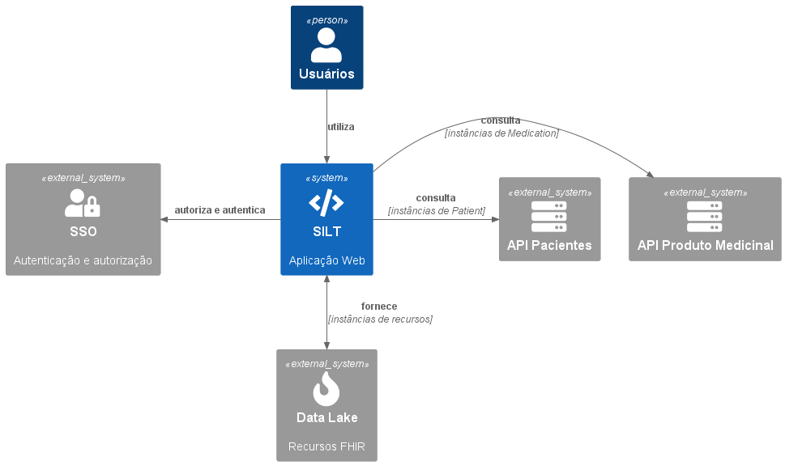
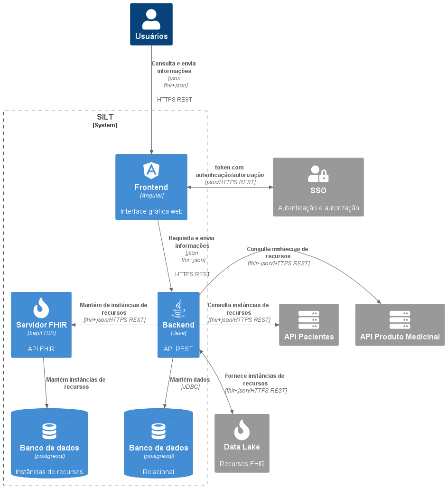
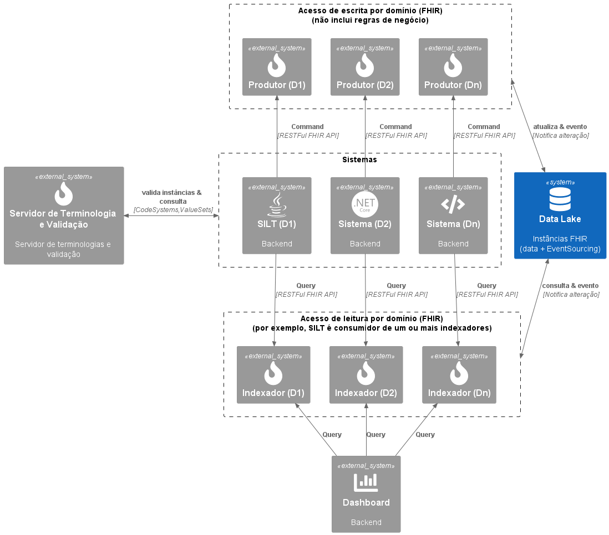

# Documentação utilizando modelo C4

O modelo C4 é composto por conjunto de diagramas organizados em hierarquia com a finalidade de descrever a arquitetura de software em níveis de abstração. Conforme aumenta o nível, a quantidade de detalhes é aumentada e com isso, é possível ter diferentes visões da arquitetura de software a medida que cada diagrama é expandido.

Ele considera visões que abordam estruturas de um sistema de software em termos de containers, componentes e código, além de pessoas que usam os sistemas de software. A seguir, cada visão é detalhada:

### Nível 1 - Contexto

Nesse nível o intuito é demonstrar as interações de forma macro, se concentrando nas comunicações
e dependências entre os sistemas e usuários que são parte do software.

### Nível 2 - Container

O diagrama de container amplia a visão do sistema de software trazida pelo diagrama de contexto, expondo a arquitetura de forma simplificada ao mostrar os containers que compõem o sistema e como se comunicam, explicitando as decisões relacionadas a tecnologia que foram tomadas.

### Nível 3 - Componente

No nível seguinte, o diagrama de componentes expande cada container individualmente, expondo seus componente com foco em funcionalidades, mapeando abstrações reais encapsuladas e apresentando suas responsabilidades e detalhes de tecnologia.

### Nível 4 - Código

No nível de código é mostrado como cada componente é implementado usando o diagrama de classes do UML.

### Referência:

* [The C4 model for visualising software architecture](https://c4model.com/)
* [O modelo C4 de documentação para Arquitetura de Software](https://www.infoq.com/br/articles/C4-architecture-model/)
* [C4-Model: por que documentar a arquitetura dos seus projetos?](https://www.zup.com.br/blog/c4-model)
* [C4 Model](https://medium.com/pravaler-digital-team/c4-model-9b6e56705496)
* [Arquitetura](https://www.databricks.com/glossary/medallion-architecture) para dados que privilegia a evolução da qualidade dos dados.

## SILT - Contexto

* **SSO** - Aplicação externa para autenticação e autorização de usuários.

* **API Pacientes** - Aplicação externa que implementa as operações definidas pelo padrão FHIR, no domínio de Pacientes.

* **API Produto Medicinal** - Aplicação externa que implementa as operações definidas pelo padrão FHIR, no domínio de Produto Medicinal.

* **SILT** - Sistema web.

* **Datalake** - Repositório de dados externo que armazena informações no contexto da SES.

## SILT - Container

* **Servidor FHIR** - Atua como validador e repositório de dados em saúde no formato FHIR. 

* **Banco de dados (Relacional)** - Repositório para dados que por motivos semânticos não foram armazenados em FHIR.

# Datalake

## Datalake - Contexto

* Utilizando CQRS

